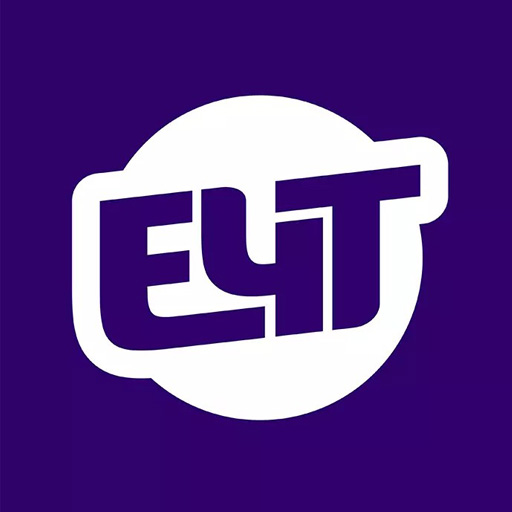

<h1 align="center">E4T Patcher</h1>

<div align="center">
  
</div>

<p align="center">
  <a href="./LICENSE"></a>
  
</p>

<p align="center">
  Gerenciador de traduções PT-BR para Nintendo Switch.<br>
  Baixe, instale e remova traduções de jogos diretamente no seu console desbloqueado.
</p>

---

## Sobre

O **E4T Patcher** é um homebrew para Nintendo Switch que facilita a instalação de traduções para a língua portuguesa (PT-BR). As traduções são baixadas diretamente no console e instaladas nos diretórios corretos do Atmosphère (`/atmosphere/contents/<title-id>/`).

O aplicativo exibe um grid com cards dos jogos disponíveis, cada um com sua capa, nome e tamanho. Traduções já instaladas são marcadas com uma estrela e exibem a opção de desinstalação.

Este projeto é baseado no [AIO-Switch-Updater](https://github.com/HamletDuFromage/aio-switch-updater/) e utiliza a biblioteca [Borealis](https://github.com/natinusala/borealis) para a interface gráfica.

## Funcionalidades

- **Grid de traduções** — Cards com capa, nome e tamanho do arquivo
- **Download direto** — Suporte a links HTTP e Mega.nz (com descriptografia AES-128 CTR on-the-fly)
- **Instalação automática** — Extração dos arquivos para a pasta correta do Atmosphère
- **Verificação de integridade** — Checagem de hash/tamanho dos arquivos instalados
- **Desinstalação** — Remove os arquivos da tradução com um clique

## Pré-requisitos

- Nintendo Switch com desbloqueio de software (Atmosphère)
- Homebrew Menu (album ou título de jogo com R)
- Acesso à internet no console

## Instalação

1. Baixe a última versão do [E4T Patcher](https://github.com/anime-world/e4t-patcher/releases/latest)
2. Extraia o arquivo `.zip` na raiz do cartão SD
3. O homebrew estará disponível em `/switch/e4t-patcher/`

## Como usar

1. Abra o Homebrew Menu (album ou segurando R ao iniciar um jogo)
2. Execute o **E4T Patcher**
3. Navegue pelo grid de traduções disponíveis
4. Pressione **A** para instalar ou desinstalar uma tradução
5. Confirme a operação e aguarde o download e a extração

Uma estrela (★) no canto superior do card indica que a tradução já está instalada. Ao pressionar A sobre um card já instalado, você poderá removê-la.

## Adicionar traduções

As traduções são definidas no arquivo `resources/translations.json`, que é copiado para `/config/e4t-patcher/translations.json` na primeira execução. Você pode editar esse arquivo para adicionar, remover ou atualizar traduções.

### Estrutura do JSON

```json
{
  "translations": {
    "Nome do Jogo": {
      "enabled": true,
      "image_link": "https://exemplo.com/capa.jpg",
      "link": "https://mega.nz/file/XXXX#chave",
      "size": "100 MB",
      "installed": {
        "uninstall": ["0100XXXX00000000"]
      }
    }
  }
}
```

| Campo | Descrição |
|---|---|
| `enabled` | Se `false`, oculta o card no grid |
| `image_link` | URL da capa do jogo (PNG, JPG ou WebP) |
| `link` | URL de download (HTTP direto ou Mega.nz com chave) |
| `size` | Texto exibido no card (ex: "100 MB") |
| `installed.uninstall` | Lista de pastas (title IDs) dentro de `/atmosphere/contents/` |

### Links Mega.nz

O formato do link Mega.nz deve incluir a chave de descriptografia:

```
https://mega.nz/file/XXXXXXXX#chaveaqui
```

## Compilação

### Dependências

- [devkitPro](https://devkitpro.org/) com pacote `switch-dev`
- `curl` (libcurl para Switch)
- `mbedtls` (para descriptografia Mega.nz)
- `libwebp` (para decodificação de imagens WebP)
- Borealis (incluído como submódulo)

### Compilar

```bash
git clone --recursive https://github.com/anime-world/e4t-patcher
cd e4t-patcher
make
```

O arquivo gerado será `e4t-patcher.nro`.

## Estrutura do projeto

```
├── source/          — Código fonte em C++
├── include/         — Cabeçalhos
├── resources/       — RomFS (imagens, traduções, i18n)
├── lib/             — Bibliotecas (Borealis, zipper, glad)
├── build/           — Artefatos de compilação
├── Makefile         — Script de build
└── icon.jpg         — Ícone do homebrew
```

## Licença

Este projeto é distribuído sob a licença **GPLv3**. Veja o arquivo [LICENSE](./LICENSE) para mais detalhes.

Nintendo Switch é uma marca registrada da Nintendo. Este projeto não é afiliado à Nintendo ou a qualquer de suas parceiras.

## Agradecimentos

- [natinusala](https://github.com/natinusala) pela biblioteca Borealis
- [HamletDuFromage](https://github.com/HamletDuFromage/) pelo AIO-Switch-Updater
- [CostelaCNX](https://github.com/CostelaCNX) pelo CNX-Updater
- A comunidade de tradução PT-BR para Nintendo Switch
